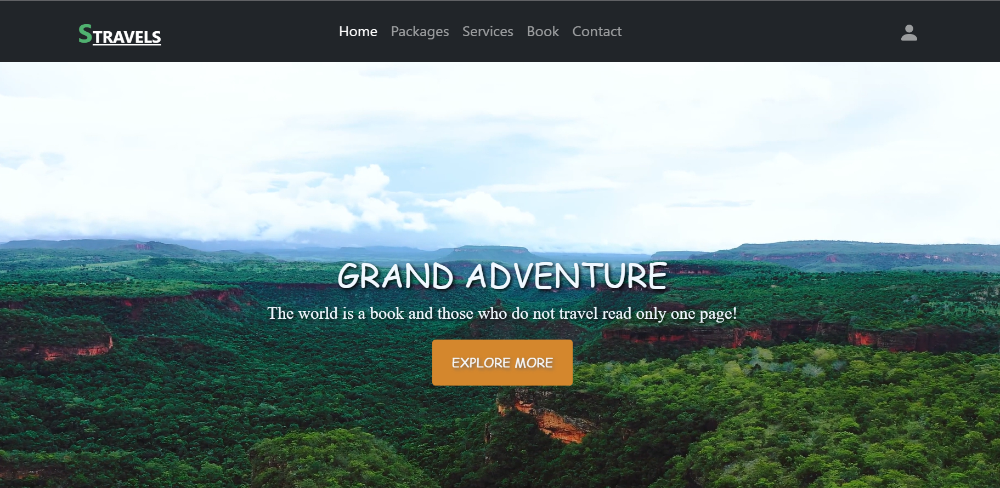
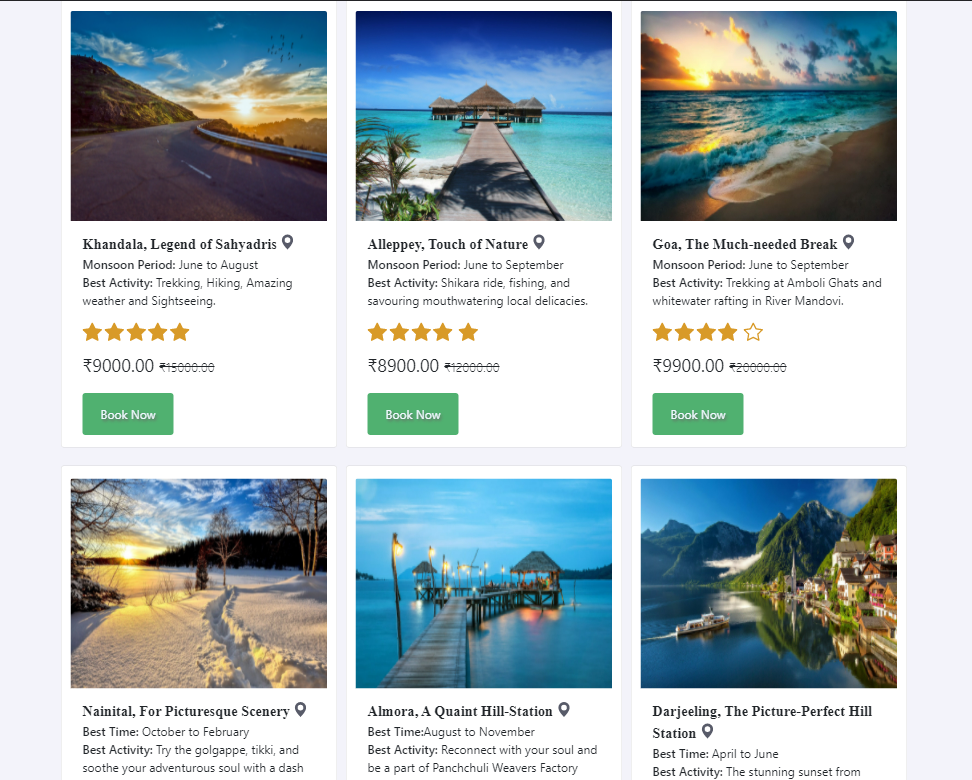
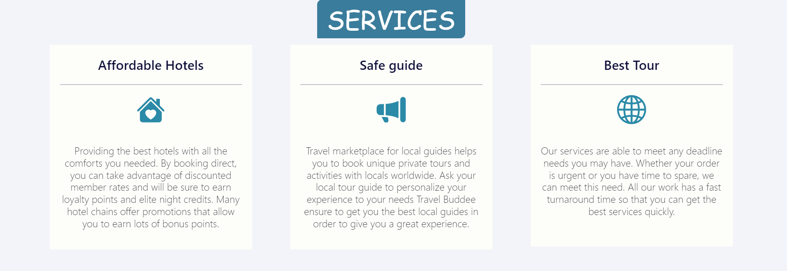
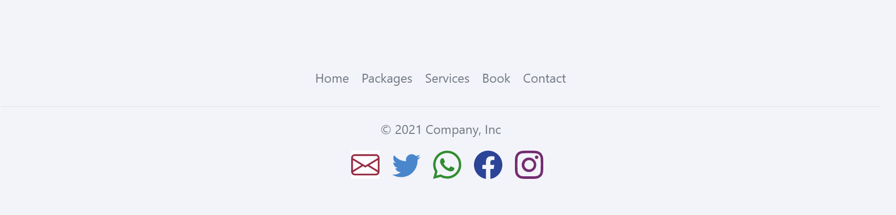
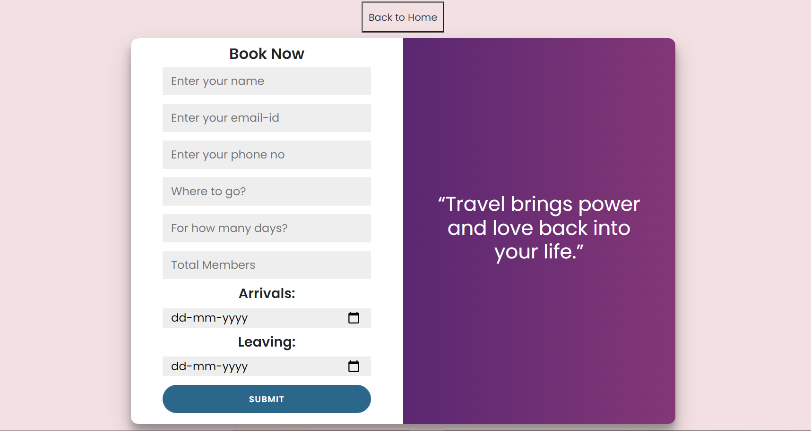
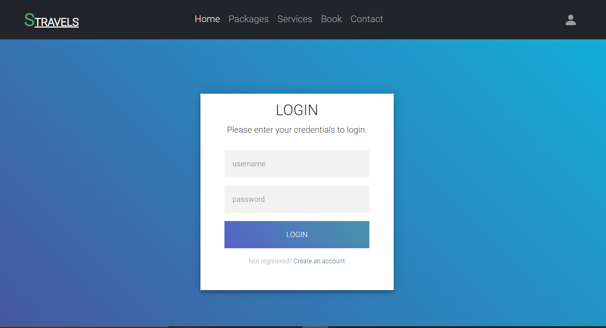

# Travel-Website

## Overview
#### The website is fully-responsive on different devices!

### Home-Page

#### The home page consists of 4-parts:
##### 1) There's a background video with a navbar for clickable links to different pages which includes:
#####    Book , Packages, Contact, Services and Footer.

### Packages
##### 2) Packages of the travel website, total 9-divs containing information of places one would like to visit.
#####    There's also a clickable button 'Book' to confirm your booking for traveling.

### Services
##### 3) Services consists of 3-divs, providing services for the travel-tour.

### Footer
##### 4) Footer has links for all the above sections and icons for social-media accounts i.e contact.

### Book-Page
##### A form for filling the details interested to visit your favourite place from the above packages.
##### There's a button 'Back to Home' that redirects you to the home-page.

### Sign In-Page
#### Sign In-Page includes Username-Input field and Password-Input field to sign-in.

### Links

- Solution URL: (https://github.com/Sonu-Dutta/Travel-website)
- Live Site URL: (https://travel-website-sonu-dutta.vercel.app/)

## My process

### Built with

- Visual Studio Code
- Semantic HTML5 markup
- CSS custom properties
- Flexbox
- CSS Grid
- Bootstrap
- Mobile-first workflow
- [React](https://reactjs.org/) - JS library
- [Next.js](https://nextjs.org/) - React framework

## Author

- Linkedin - [Sonu-Dutta](https://www.linkedin.com/in/sonu-dutta-6900b3218)
- Twitter - [@sonudutta9999](https://mobile.twitter.com/sonudutta9999)

